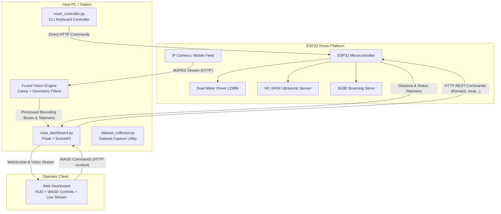

# 🤖 VISAR: Visual Inspection & Structural Analysis Rover
### *Real-Time Autonomous Teleoperation & Fused Computer Vision Crack Detection System*

---

## 📌 Overview

**VISAR** is an integrated IoT and computer-vision robotics platform engineered for structural health monitoring, surface crack detection, and remote inspection. The system couples an **ESP32-driven robotic rover** with an advanced **OpenCV-based Fused Vision Engine** and a real-time **Flask-SocketIO telemetry dashboard**.

Whether deployed for inspecting walls, tunnels, bridges, or concrete infrastructure, VISAR delivers real-time live video streaming, AI-based morphological crack segmentation, distance gating, and low-latency teleoperation.

---

## 🏗️ System Architecture



---

## ✨ Key Features

- **Advanced Fused Vision Engine**:
  - Distinguishes organic cracks from manufactured straight edges (wires, conduits, pens, shadows).
  - Uses contour circularity, convexity solidity, rectangularity ratios, and polygonal complexity checks.
  - Automatically classifies severity: `CLEAN`, `CRACK DETECTED`, or `CRITICAL SPALLING` (voids > 15,000 px).
- **Dual Operating Modes**:
  - **Manual Mode**: Real-time teleoperation via browser HUD keypad, keyboard shortcuts (W/A/S/D), or standalone CLI controller.
  - **Autonomous Obstacle Avoidance Mode**: Ultrasonic ping sweep using a servo motor with dynamic left/right path selection.
- **Glassmorphic Mission Dashboard**:
  - Full-screen Heads-Up Display (HUD) with dark aesthetic.
  - Live crack count counter and severity badge updates pushed instantaneously over SocketIO.
  - Integrated low-latency MJPEG video stream feed.
- **Dataset Capture Utility**:
  - Automated 5-round burst capture script with buffer clearing for training custom YOLO models.

---

## 🗂️ Project Directory Structure

```text
VISAR DRIVING CODE/
├── visar_dashboard.py       # Main entry point: Flask web server, OpenCV pipeline & SocketIO
├── rover_controller.py      # Standalone CLI keyboard controller for Rover driving
├── dataset_collector.py     # Automated burst image collector for model training
├── templates/
│   └── index.html           # Modern glassmorphism web dashboard UI & HUD controls
├── firmware/
│   └── esp32_rover/
│       └── esp32_rover.ino  # ESP32 Arduino C++ firmware (HTTP server, motors, servo, ultrasonic)
├── cracks/                  # Sample crack imagery and test assets
├── dataset_cracks/          # Auto-generated directory for captured training photos
├── .venv/                   # Python virtual environment with all required packages
└── README.md                # Project documentation
```

---

## 🔌 Hardware Setup & Pin Configuration

### ESP32 Pin Connections

| Peripheral | ESP32 Pin | Description |
| :--- | :--- | :--- |
| **Motor 1 IN1** | `GPIO 14` | Left Motor Direction A |
| **Motor 1 IN2** | `GPIO 27` | Left Motor Direction B |
| **Motor 1 ENA** | `GPIO 12` | Left Motor Speed Enable |
| **Motor 2 IN3** | `GPIO 26` | Right Motor Direction A |
| **Motor 2 IN4** | `GPIO 25` | Right Motor Direction B |
| **Motor 2 ENB** | `GPIO 13` | Right Motor Speed Enable |
| **Ultrasonic TRIG** | `GPIO 4` | HC-SR04 Trigger Pulse |
| **Ultrasonic ECHO** | `GPIO 5` | HC-SR04 Echo Input |
| **Scanning Servo** | `GPIO 18` | SG90 PWM Control (50 Hz) |

---

## 🚀 Getting Started

### 1. Prerequisites
- **Python 3.10+** (Python 3.13 installed in `.venv`)
- **ESP32 Development Board** & Arduino IDE (with `ESP32Servo` and `WiFi` libraries)
- **IP Camera / Android Smartphone** running an RTSP/MJPEG app (e.g. *IP Webcam*) connected to the same local WiFi.

### 2. Dependencies Installation
Activate the virtual environment and install dependencies:

```powershell
# In PowerShell:
.\.venv\Scripts\Activate.ps1
pip install flask flask-socketio opencv-python numpy requests keyboard
```

---

## ⚙️ Configuration

Before running, update your local IP addresses in the scripts:

1. **In `visar_dashboard.py`**:
   ```python
   ESP32_IP = "10.101.122.229"               # IP assigned to your ESP32 rover
   CAM_URL  = "http://10.101.122.19:8080/video"  # Live camera RTSP or HTTP MJPEG URL
   ```

2. **In `rover_controller.py` & `dataset_collector.py`**:
   Ensure `ESP32_IP` and `CAM_URL` match your current network setup.

3. **In `firmware/esp32_rover/esp32_rover.ino`**:
   Set your WiFi credentials:
   ```cpp
   const char *ssid     = "YOUR_WIFI_SSID";
   const char *password = "YOUR_WIFI_PASSWORD";
   ```

---

## 🖥️ Running the Applications

### 1. Launch the Main Web Dashboard
Starts the web server, camera reader thread, telemetry loop, and crack detection pipeline:

```powershell
& ".\.venv\Scripts\python.exe" "visar_dashboard.py"
```

- **Local Dashboard:** [http://127.0.0.1:5000](http://127.0.0.1:5000)
- **Network / Mobile Access:** `http://<YOUR_LOCAL_IP>:5000`

#### Browser Keyboard Controls:
- <kbd>W</kbd> : Drive Forward
- <kbd>S</kbd> : Reverse
- <kbd>A</kbd> : Turn Left
- <kbd>D</kbd> : Turn Right
- *(Releasing any key immediately halts the rover)*

---

### 2. Standalone CLI Keyboard Controller
Drive the rover directly from your terminal without opening a browser:

```powershell
& ".\.venv\Scripts\python.exe" "rover_controller.py"
```
- Controls: <kbd>W</kbd>, <kbd>A</kbd>, <kbd>S</kbd>, <kbd>D</kbd> or Arrow Keys. Press <kbd>ESC</kbd> to quit.

---

### 3. Automated Dataset Collector
Collect burst sets of crack images to train custom object detection models:

```powershell
& ".\.venv\Scripts\python.exe" "dataset_collector.py"
```
- Guides you through 5 inspection rounds.
- Automatically flushes OpenCV buffers and saves high-resolution raw frames to `dataset_cracks/`.

---

### 4. Uploading ESP32 Firmware
1. Open [firmware/esp32_rover/esp32_rover.ino](file:///c:/Users/susan/OneDrive/Desktop/VISAR%20CODE/VISAR%20DRIVING%20CODE/firmware/esp32_rover/esp32_rover.ino) in **Arduino IDE**.
2. Select Board: **ESP32 Dev Module**.
3. Install the **ESP32Servo** library via Library Manager.
4. Verify, compile, and upload to the ESP32.
5. Open the Serial Monitor at `115200 baud` to note the assigned IP address.

---

## 📡 API Endpoints Reference

### ESP32 Embedded Web Server (`http://<ESP32_IP>/`)

| Endpoint | Method | Parameters | Description |
| :--- | :--- | :--- | :--- |
| `/` | `GET` | — | Embedded standalone emergency web controller |
| `/forward` | `GET` | — | Sets motor directions forward |
| `/reverse` | `GET` | — | Sets motor directions reverse |
| `/left` | `GET` | — | Turns rover left |
| `/right` | `GET` | — | Turns rover right |
| `/stop` | `GET` | — | Stops all motor output |
| `/mode` | `GET` | `?m=auto` / `?m=manual` | Toggles autonomous obstacle avoidance |
| `/status` | `GET` | — | Returns JSON: `{"mode": "manual", "distance": 18.5}` |

### Flask Dashboard Server (`http://localhost:5000/`)

| Endpoint | Method | Description |
| :--- | :--- | :--- |
| `/` | `GET` | Main telemetry HUD & teleoperation page |
| `/video_feed` | `GET` | Multipart MJPEG stream with overlayed crack annotations |
| `/control` | `GET` | Proxy command dispatcher to the ESP32 (`?cmd=forward`, etc.) |
| `SocketIO: telemetry_vision` | Event | Emits live crack count and severity classifications |
| `SocketIO: telemetry_hw` | Event | Emits current control mode and distance readings |

---

## 🔬 Vision Engine Details

The crack detection pipeline operates with multi-stage geometric filtering:
1. **Adaptive Pre-filtering**: Grayscale conversion and Gaussian blur (`5x5`) to suppress surface texture noise without erasing hairline cracks.
2. **Canny Edge Extraction**: Low and high thresholds tuned (`20`, `80`) to capture faint surface deviations.
3. **Morphological Dilation**: Uses a `5x5` structuring element to bridge fragmented crack segments.
4. **Circularity Filter**: Rejects circular objects (e.g. screws, washers, lenses) where $(4 \pi \cdot \text{Area}) / \text{Perimeter}^2 > 0.35$.
5. **Solidity & Hull Analysis**: Distinguishes meandering organic fissures from smooth objects (pens, cables) where area-to-convex-hull ratio $> 0.80$.
6. **Polygonal Complexity (RDP Approximation)**: Rejects quadrilaterals and straight lines (wire segments) with $\le 4$ polygon vertices.
7. **Severity Rating**:
   - $\text{Area} > 15,000 \text{ px} \implies$ **CRITICAL SPALLING**
   - $\text{Valid Contours} > 0 \implies$ **CRACK DETECTED**
   - No detections $\implies$ **NORMAL / CLEAN**

---

## 🛡️ License & Contributing

Built for academic and experimental robotics research. Feel free to fork, expand the vision filters, or contribute additional autonomous path-planning algorithms.
